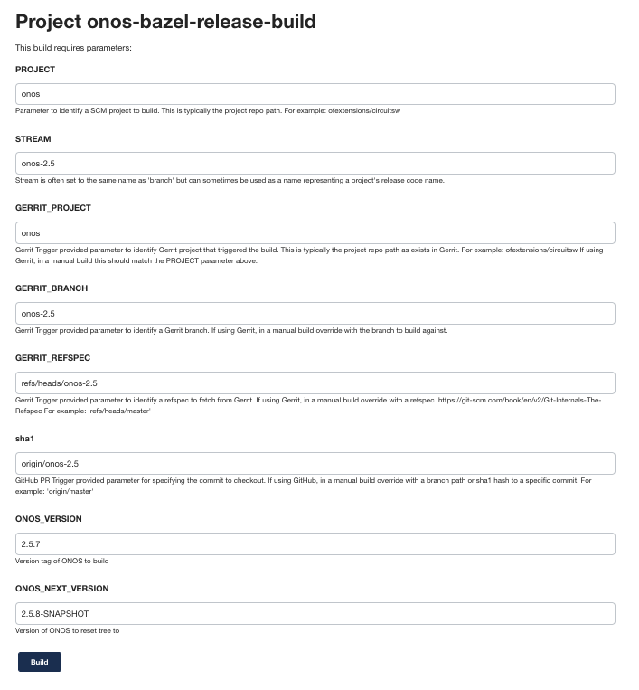

# ONOS Release Process Notes
To release ONOS software builds you will need the following:
* An account on ONOS Jenkins (jenkins.onosproject.org) with administrator privileges
* An account on open source sonatype (oss.sonatype.org) with the `org.onosproject` staging profile
* An account on ONOS gerrit (gerrit.onosproject.org) with push privileges

ONOS releases are done by Continuous Integration (CI) jobs on Jenkins. There
are two jobs that are run manually when a release is produced:
* `onos-bazel-release-build` - builds ONOS artifacts, pushes the artifacts to sonatype, tags gerrit repo
  with the release identifier, and publishes API documentation
* `onos-docker-build` - builds a docker image for ONOS and pushes it to docker hub

## ONOS version strings
ONOS uses 3 part version numbers to name releases, using the form `major.minor.patch`. For special purpose builds that
aren't full releases, a suffix may be added to the patch number to indicate a beta build or a release candidate build.
* A regular release version looks like `2.5.7` and indicates a fully supported release. These are always built from a
_support branch_ (more on this later)
* A beta release may be created at any time during the release cycle. These are used if early access is needed by
external applications to an ONOS API change, or as a test of the release process. These are versioned like `2.5.7-b1`
with ascending beta release numbers. Betas may be released from a support branch or `master`
* A release candidate is created at the end of a release cycle, usually to give QA a chance to test the final versions
of a release. These are usually built from support branches. They are versioned like `2.5.7-rc1` with ascending
release candidate numbers.

## Support branches
Support branches are created late in the release cycle to freeze development of a release and allow further work to
continue on the `master` branch. Once a support branch is created, any bug fixes to that release must go on `master`
as well as the support branch. Official releases are _always_ built from support branches. The release branch name is
derived from the major and minor numbers of the release. So for example, the support branch for ONOS 2.5 is called
`onos-2.5`. All 2.5 point releases are built from this branch (`2.5.0`, `2.5.1`, etc.)

### Procedure to create a release branch
```shell
# Start on master, with an up to date tree
# set the release branch name here
export RELEASE="2.5"
export NEXT_RELEASE="2.6"
git checkout master
git pull

# Create the new branch
git checkout -b onos-$RELEASE master

# now on new branch
# edit .gitreview, set defaultbranch to new branch name
defaultbranch=onos-$RELEASE

# push the new branch to gerrit
git push origin onos-$RELEASE

# commit your change to .gitreview
# you will have to verify this by hand, there is no verify job for the new
# branch yet
git add .gitreview
git commit -m "bumping to version $RELEASE"
git review

# go back to master
git checkout master

# create a new local branch for the next release on master
git checkout -b branch-$NEXT_RELEASE

# change the versions to be the next release.
onos-snapshot $NEXT_RELEASE.0-SNAPSHOT

# remove debris left behind by the version setting
find . -name *.versionsBackup | xargs rm

# put the version changes into gerrit
git review

# when the verification jobs finish, +2 and submit this change

# now add jobs to verify the new support branch
# check out the ci-management tree
# edit jjb/onos/onos-verify.yaml
# add the new branch to the onos and onos-gui verify jobs
# submit and merge these changes
```

## ONOS Artifacts Build

The first step to a release is the ONOS release artifacts build. This will create the JAR files and other artifacts that comprise
a release, package them, post them to a staging repo on `oss.sonatype.org`, and place a tag in the gerrit repo
marking the release point.

An artifact release is done using the `onos-bazel-release-build` job on ONOS Jenkins. To begin a release build, go to the [Jenkins
release build job](https://jenkins.onosproject.org/view/onos-release/job/onos-bazel-release-build/) and click
_Build with Parameters_ on the menu on the left. A form will come up that is used to specify the parameters for the build.
The defaults for the build form are to build version 1.15 from the `master` branch. To do a build, we will have to
change these defaults. In the example given below, we are going to build version `2.5.7` from the `onos-2.5` support branch.
Note that the string `master` is replaced with our branch name `onos-2.5` in the `STREAM`, `GERRIT_BRANCH`,
`GERRIT_REFSPEC`, and `sha1` fields. The `ONOS_VERSION` is set to `2.5.7` and the `ONOS_NEXT_VERSION` is set to
`2.5.8-SNAPSHOT`. The next version always has `-SNAPSHOT` in the name, as it will be used for ongoing development on
the support branch.



When this job is completed, there will be several staging repos created on `sonatype` and the repo will have the tag
`2.5.7` applied to it.

## ONOS Docker Build
Once the release build is done and the tag for the release is in place, we can do the docker
image build. The `onos-docker-build` job on Jenkins will create the docker image based on the tag, and
push the resulting docker image to DockerHub.

To create the docker image, go to the [docker release build job](https://jenkins.onosproject.org/view/onos-release/job/onos-docker-build/)
on Jenkins. Click the _Build with Parameters_ link in the menu on the left. A form will come up
that is used to specify the parameters for the docker image. The defaults for the form are to build from the
`master` branch. In the example given below, we are going to build a Docker image for the ONOS 2.5.7 release from the `onos-2.5`
support branch. Note that the string `master` to indicate the branch to build from is
replaced with `onos-2.5` in the `STREAM`, `GERRIT_BRANCH`, `GERRIT_REFSPEC`, and `sha1` fields.
In the `ONOS_TAG` field we put the `2.5.7` tag for our release.


## Incorporating a New of Release Karaf

These instructions are for the 4.2.14 release. Modify the version number as required.

### Prerequisites
* gpg
* md5
* shasum

### Steps to update karaf:
* Download base karaf bundle
```bash
rm -rf /tmp/karaf && mkdir -p /tmp/karaf
cd /tmp/karaf && curl -O https://dlcdn.apache.org/karaf/4.2.14/apache-karaf-4.2.14.tar.gz
```
* Upload base karaf to maven central
```bash
export SONATYPE_USER=<your-user>
export SONATYPE_PASSWORD=<your-password>
$ONOS_ROOT/tools/build/push-karaf 4.2.14 /tmp/karaf
```

* Publish the new karaf bits:
    * Log into sonatype and release the staging repo
    * Update ONOS to use new base version
    * Update deps.json to change the karaf references from the old release to the new one
    * Run onos-lib-gen
    * Update tools/package/etc files to refer to the new karaf version (may require merging changes)
        * org.apache.karaf.features.cfg
        * startup.properties

* Update packaging tools (these all have references to the karaf version)
    * tools/package/bin/onos-backup
    * tools/package/bin/onos-restore
    * tools/package/dependencies/template.pom
    * tools/package/onos-prep-karaf
    * tools/package/onos_stage.py
    * tools/package/deb/prerm

* Update build tools
    * tools/build/bazel/osgi_features.bzl
    * tools/build/envDefaults

* Update test tools
    * tools/test/bin/onos-check-bits

* Test ONOS
    * bazel run onos-local clean
    * make sure CLI comes up
    * make sure GUI comes up
* Create offline karaf bundle (need a cell node for this)

```shell
export KARAF_RELEASE_VERSION=4.2.14

export OC1=<cell IP>

cd /tmp/karaf && $ONOS_ROOT/tools/build/build-offline-karaf
```

* Upload offline karaf bundle (it will be named with today's date)

```shell
$ONOS_ROOT/tools/build/push-karaf 4.2.14-offline-20220105 /tmp/karaf
```

* Publish the new offline karaf bits
    * Log into sonatype and release the staging repo
* Modify ONOS to use offline bundle
    * Edit deps.json to refer to the offline bundle
    * Run onos-lib-gen
    * Test ONOS
* Finish off the PR
    * Merge your changes locally and make a gerrit PR. All done!

### Side projects requiring an update

* aether-pod-configs
* cord-ci-management
* onos-helm-charts
* sdfabric-docs
* sdfabric-helm-charts
* up4
* tost-onos
* voltha-onos

